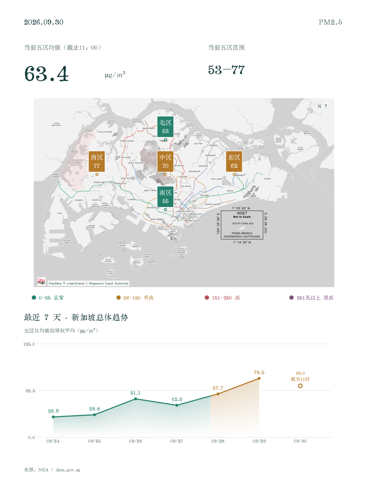
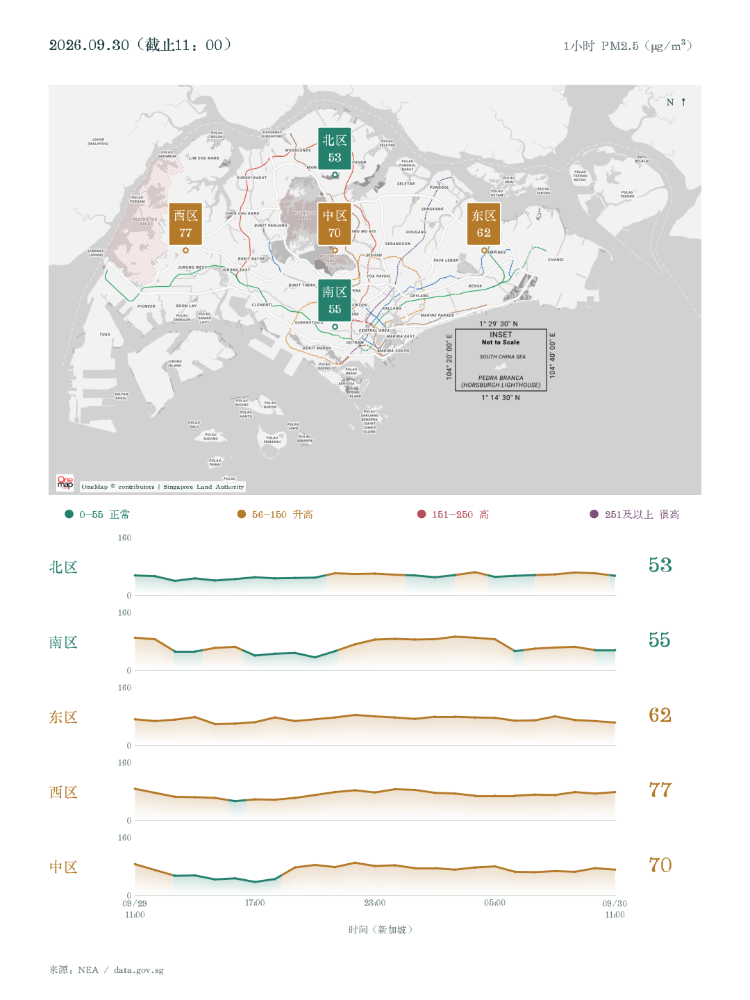

# Singapore air quality, two charts a day

[中文](README.md) · [Usage guide (Chinese)](docs/usage.md) · [Building with an agent (Chinese)](docs/build-with-agent.md)

A small Python project built with an AI coding agent to follow Singapore's PM2.5 levels. Once the data and chart rules are settled, scripts handle the daily work. Fetching, calculating and rendering do not require an LLM.

## Preview

Historical example: **30 September 2026, 11:00 Singapore time**. These images are not live readings.

| Island overview | Regional comparison |
| --- | --- |
|  |  |

Data: NEA / data.gov.sg. Basemap: SLA OneMap. Charts are exported as 1080 × 1440 PNG and SVG, with Chinese labels.

## Run locally

Python 3.10+ and internet access required. On macOS / Linux:

```bash
git clone https://github.com/R1cK-ChaN/singapore-air-quality.git
cd singapore-air-quality
python3 -m venv .venv
.venv/bin/python -m pip install -r requirements.txt
.venv/bin/python setup_font.py
.venv/bin/python daily.py
```

On Windows, create the environment with `py -3 -m venv .venv` and use `.venv\Scripts\python.exe` instead of `.venv/bin/python`.

Run after 11:00 SGT. The script waits for all five regions' 11:00 readings, polling every 60 seconds for up to an hour. Use `--date 2026-09-30` to reproduce a historical date at any time. Official readings may be revised after publication.

Outputs are saved under `output/YYYY-MM-DD/cards/`. Check `daily_run.json` for `status=complete`. API errors and missing readings are reported rather than replaced with invented values.

If the initial download hits `HTTP 429`, wait a minute or two and rerun the same command. Completed historical downloads are reused.

## Daily execution

Schedule the script for **11:05 Asia/Singapore** using a scheduler of your choice. This repository has no enabled cloud job or LLM integration. The author's local Codex task launches the script and reports completion; that separate configuration involves model calls and requires the computer and app to remain running.

## Interpretation

The charts show one-hour PM2.5 concentrations in μg/m³, not PSI or AQI. Regional means are equally weighted, not an official national index. Today's partial mean is shown separately from completed daily averages. Missing observations are not filled in. Colors follow concentration thresholds of 55, 150 and 250; colors on daily averages do not represent official health categories. Regional coordinates are reference locations, not exact monitoring stations. Concentrations alone cannot establish a pollution source.

## Development

```bash
python3 -m unittest discover -s . -p 'test_*.py' -v
```

`air_quality.py` fetches and normalizes observations; `cards.py` renders charts; `daily.py` runs the daily edition; `typography.py` configures the font.

## License and sources

Original code and documentation: [MIT](LICENSE). Data, map tiles and the separately downloaded font retain their own terms. See [third-party notices](THIRD_PARTY_NOTICES.md) and [font details](fonts/README.md).
